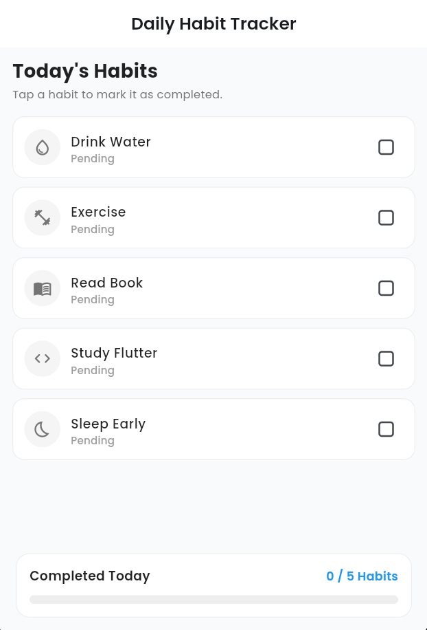
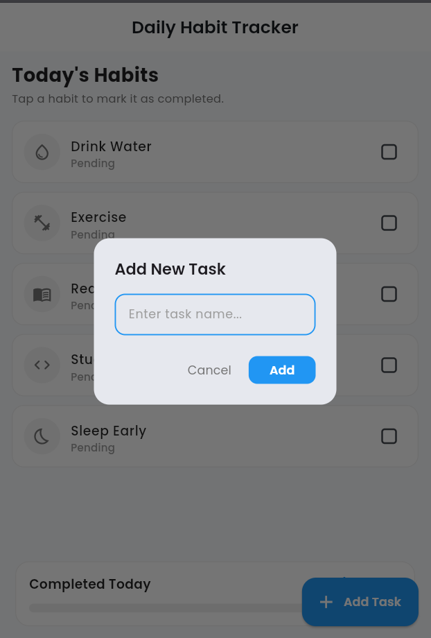
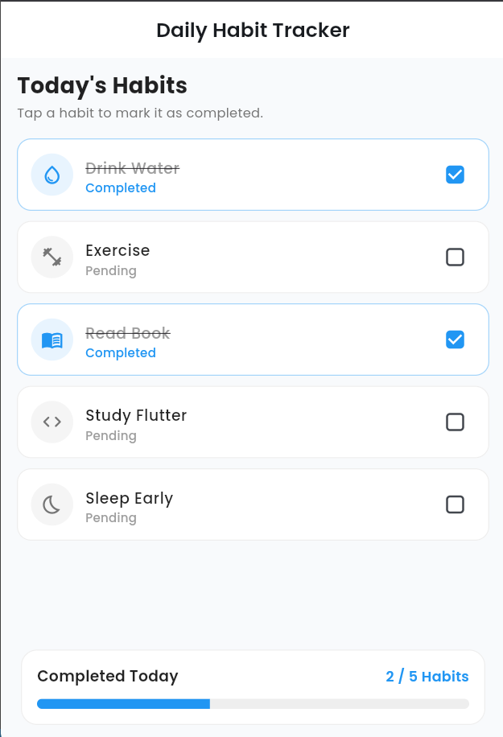

# proj-10-habit-tracker

A Flutter application designed to help users build daily consistency, track habit completion, and manage routines effortlessly with Provider state management.

Repository URL: https://github.com/apandey-dev/proj-10-habit-tracker

## Preview Images

### Home Screen Preview


### Add Task Preview


### Complete Task Preview


## Features

- Daily habit creation and progress tracking
- Interactive task creation with custom habit entry
- Interactive task completion with instant state updates
- Global state management using Provider architecture
- Clean Material 3 design with Google Fonts (Poppins) typography
- Cross-platform support across Android, iOS, Web, and Desktop

## Getting Started

### Prerequisites

- Flutter SDK (version 3.12.2 or higher)
- Dart SDK

### Installation

1. Clone the repository:
   ```bash
   git clone https://github.com/apandey-dev/proj-10-habit-tracker.git
   ```

2. Navigate to the project directory:
   ```bash
   cd proj-10-habit-tracker
   ```

3. Install dependencies:
   ```bash
   flutter pub get
   ```

4. Run the application:
   ```bash
   flutter run
   ```

## Project Structure

```
proj-10-habit-tracker/
├── assets/
│   ├── add_task.png
│   ├── complete_task_preview.png
│   └── home_preview.png
├── lib/
│   ├── provider/
│   ├── screens/
│   └── main.dart
├── pubspec.yaml
└── README.md
```

## License

This project is licensed under the MIT License.
